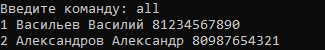

# Notebook

This is a small notebook console application with the ability to create, edit, view and delete entries. This is my first C# project done for educational purposes.
 

### Create note
 

### Edit note

### Show note

### Show all notes

