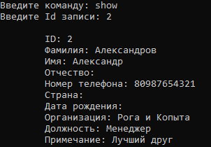

# Записная книжка

Это небольшое консольное приложение, представляющее собой записную книжку с возможностями создавать, редактировать, просматривать и удалять записи. Это мой первый проект на C#, выполненный в учебных целях.
 

### Создание записи
 

### Редактирование записи

### Просмотр записи

### Просмотр всех записей

